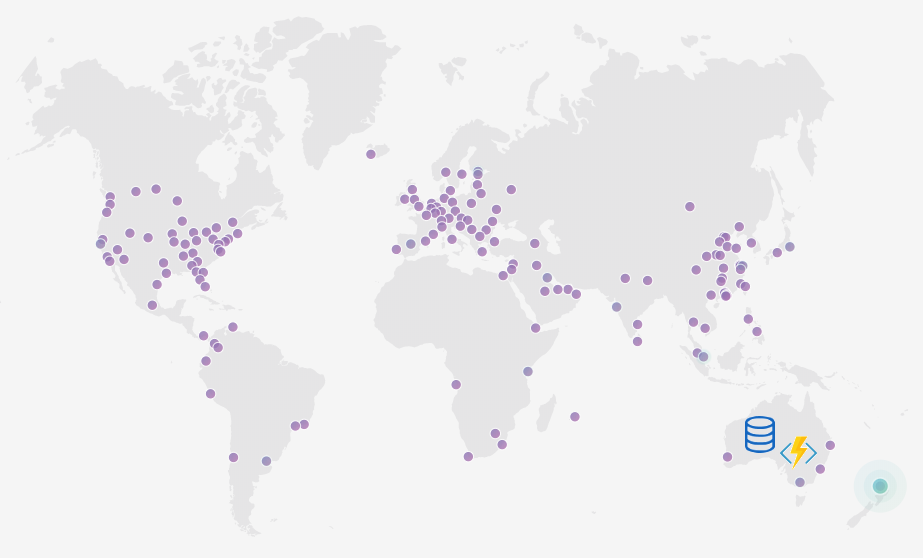

###### Photo by [Juan Arreguin](https://unsplash.com/photos/V9ehOMxti60?utm_source=unsplash&utm_medium=referral&utm_content=creditCopyText) on [Unsplash](https://unsplash.com/collections/3351204/mountains-and-cliffs/7c72ed4c4c766861c5f3f350646b752b?utm_source=unsplash&utm_medium=referral&utm_content=creditCopyText)

I love serverless. It's a developer's dream: very cheap, massively/quickly scalable compute with no infrastructure details to worry about.

When you deploy your serverless project you must pick a region (a data center) to host your code. Your choice of region will influence how much latency a user will experience. In general, the further away the user is, the higher the latency. I'm acutely aware of this, living in New Zealand.

\[caption id="attachment\_4829" align="alignnone" width="1208"\] Example of latency between Wellington, New Zealand, and some Azure data centers\[/caption\]

# How can you address this?

When I start a project I ask myself: where are the users?

With my side project, I'll be targeting users close to home: Australia and New Zealand. I'll put the API (my serverless Azure Functions) and data near them.

What if I have traffic from around the world? Or I start to grow? They can all come to Australia but latency sucks.

I could create multiple instances of my serverless API (where I think my users are located) and use a traffic manager to geographically distribute traffic. It's a bit of effort to set up, but it works.

Yay! People are near my endpoints, but what about the data? It's all centrally stored in one spot. Darn it!

Replicating the data can be difficult, expensive, and, in some cases, just not possible.

Even if it was possible I probably can't afford to put a replica everywhere so some regions will just have to share i.e. North America, Europe, and Asia get one each. Thats ok'ish.

I'd likely scrap the design at this point. It's become too hard and expensive.

Upon reflection, I realize I don't need everything to be remote. My primary concern is the heavily read data and its corresponding endpoints. Another easy win would be to prevent calls from coming to Australia, such as those with invalid auth details.

If only there were other tools at my disposal...

# Enter Cloudflare Workers

The map I've been using is of the [Cloudflare network](https://www.cloudflare.com/network/).

\[caption id="attachment\_4826" align="alignnone" width="923"\] Something close to me! That green dot is Auckland. It's over 600 km away from Wellington but better than Sydney which is 2,200+ km away via an undersea cable\[/caption\]

Imagine you can run code in any of these locations. Write your function, deploy it once and it just works. That's Cloudflare Workers: serverless compute run on the edge (in those locations near your users).

You can read more about [Workers here](https://www.cloudflare.com/products/cloudflare-workers/), but I'd thought I'd give you a quick tour.

Below is my DNS setup for [Wolf Tracker](https://www.wolftracker.nz/) (blog post [here](http://liftcodeplay.com/2017/12/20/wolf-tracker-vue-js-azure-functions-more-for-a-secure-cheap-highly-scalable-spa/)). If the cloud is orange, as it is for `www` and `root`, then it's proxying through Cloudflare. Otherwise, Cloudflare is only providing DNS.

If you are proxied through Cloudflare you can use a Worker. The worker allows you to intercept a request and do whatever you like to it. Below is a simple example.



With my Wolf Tracker app, I've started to do the following with Workers:

- Move [Authentication (verification of JWTs) to the edge](http://liftcodeplay.com/2018/10/01/validating-auth0-jwts-on-the-edge-with-a-cloudflare-worker/)
    - I can remove this code from my Azure Functions
    - If it fails (i.e. expired JWT) it does so on the edge. My functions are not affected
- Proxy endpoints to a different URL
    - If I am presented with `api.wolftracker.nz/api/v1/getwolves` I can call the actual URL `api.wolftracker.nz/api/getwolves` (which does not have **v1**)
- Always return an API version, in the response header

I have a dream: to build whole endpoints that are purely available on the edge. It's great that I have this compute available everywhere but my data is in Australia...

## Enter Cloudflare Workers KV

I believe this was my reaction when I heard about the [Workers KV](https://www.cloudflare.com/products/workers-kv/) (Key Value) beta.

\[caption id="attachment\_4827" align="aligncenter" width="350"\] OMG - the possibilities!\[/caption\]

The [docs from Cloudflare](https://developers.cloudflare.com/workers/kv/) explain KV well:

**Workers KV is a global, low-latency, key-value data store**. It supports exceptionally high read volumes with low-latency, making it possible to build highly dynamic APIs and websites which respond as quickly as a cached static file would.

**Workers KV is generally good for use-cases where you need to write relatively infrequently, but read quickly and frequently**. It is optimized for these high-read applications, only reaching its full performance when data is being frequently read. Very infrequently read values are stored centrally, while more popular values are maintained in all of our data centers around the world.

KV achieves this performance by being **eventually-consistent**. New key-value pairs are immediately available everywhere, but value changes may take up to ten seconds to propagate. Workers KV isn’t ideal for situations where you need support for atomic operations or where values must be read and written in a single transaction.

This doc also explains the [current limitations](https://developers.cloudflare.com/workers/kv/limitations/).

I'm paying $5 USD a month for workers. With that, I get 1 GB of KV storage and up to 10 million KV reads. Beyond that, it's quite cheap.

The single most crucial point for me is: **this is data that can be stored ON THE EDGE**! My worker doesn't need to come all the way to Australia. That crazy dream I have is now a possibility.

## OMG OMG OMG - LET'S BUILD SOMETHING!

Well, that comes to the end of this blog post.

In [the next post](http://liftcodeplay.com/2018/10/16/pushing-my-api-to-the-edge-part-2-authentication-and-authorization/), I'll talk about how I use a Cloudflare Worker and KV to refactor my API and start moving functionality to the edge.
