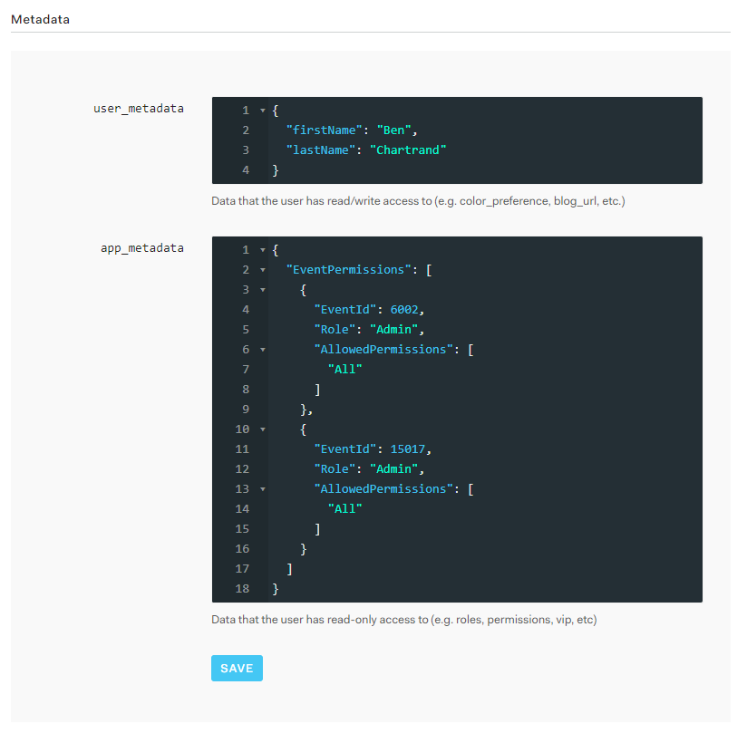
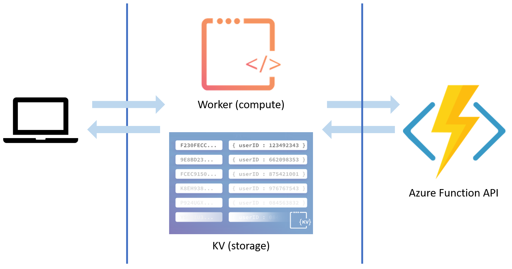
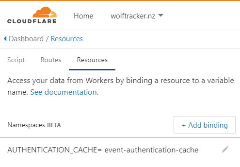
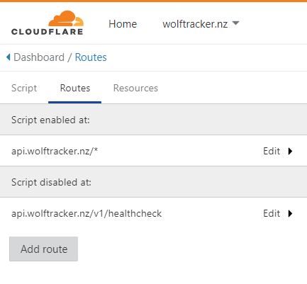
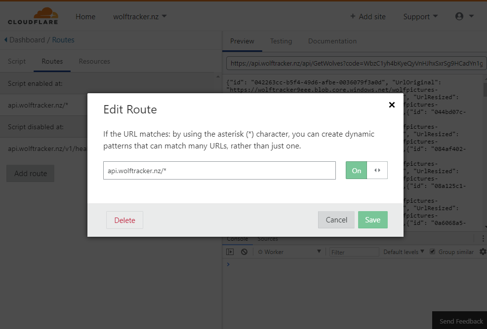
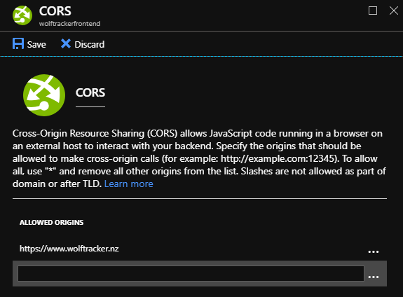
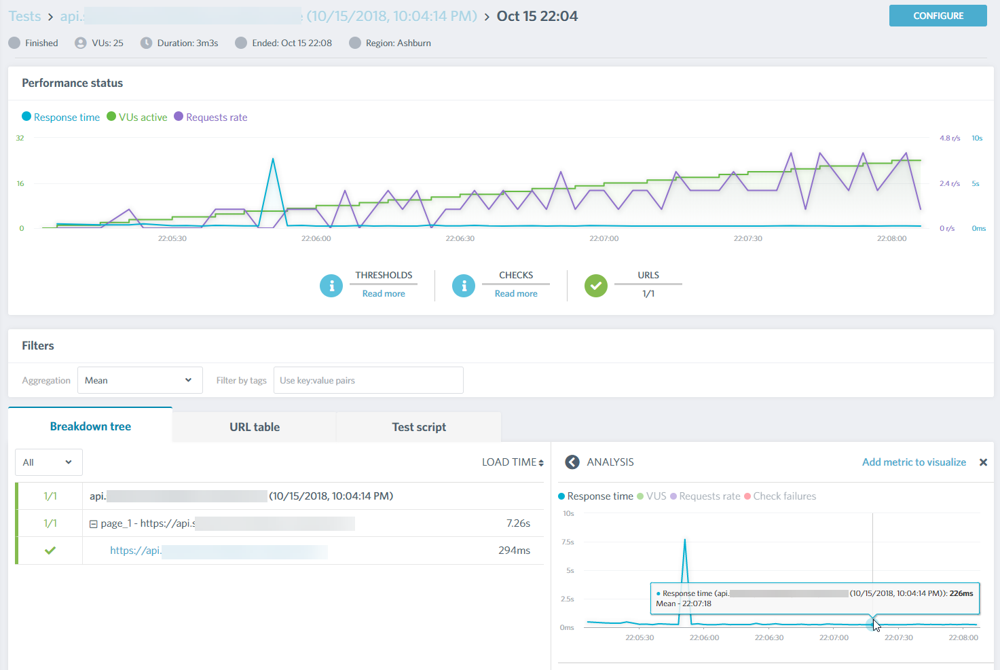
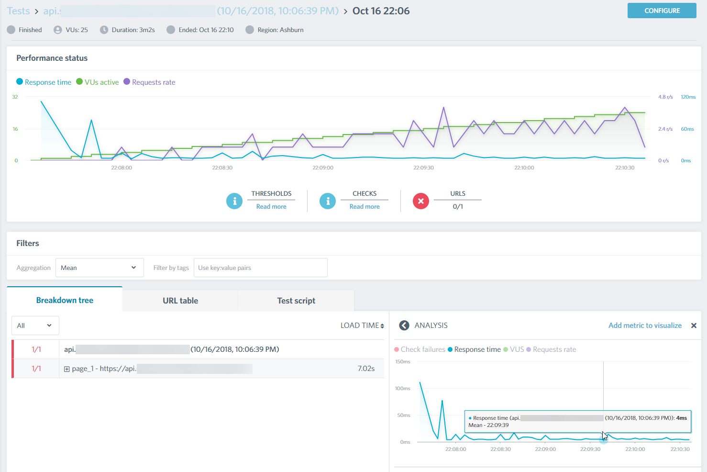

###### Photo by [Valdemaras D.](https://unsplash.com/photos/khbjgGAerPU?utm_source=unsplash&utm_medium=referral&utm_content=creditCopyText) on [Unsplash](https://unsplash.com/?utm_source=unsplash&utm_medium=referral&utm_content=creditCopyText)

If you haven't done so already, checkout [Part 1 - Intro to Cloudflare Workers + KV](http://liftcodeplay.com/2018/10/10/pushing-my-api-to-the-edge-part-1-intro-to-cloudflare-workers-kv/).

Let's walk through how I moved Authentication and Authorization to the edge using Cloudflare Workers and Workers KV (Key-Value storage).

# Background

A while back I decided to write an API using [ASP.NET Core](https://docs.microsoft.com/en-us/aspnet/core/?view=aspnetcore-2.1) with [Auth0](https://auth0.com/) as my identity provider.

The setup process for Auth0 in ASP.NET Core was straightforward as there was an authorization framework I could slot Auth0 into. Once setup, it was a joy to use and required very little code (mostly just an attribute) per endpoint.

One day I decided to go serverless and re-write my API using [Azure Functions](https://azure.microsoft.com/en-us/services/functions/). Auth0 integration quickly became a challenge as there was no authorization framework. I had to write code to:

1. [Validate the JWTs](http://liftcodeplay.com/2017/11/25/validating-auth0-jwt-tokens-in-azure-functions-aka-how-to-use-auth0-with-azure-functions/)
2. Access Auth0 to get authorization information

The worst part is I had to manually add to functionality to every HTTP trigger (endpoint in my API).

After several rounds of refactoring and making the most of the limited dependency injection, I came up with something like the following.

https://gist.github.com/bcnzer/c3d45a7bb55255ceb153a607b0bf702d

## Authorization

With every request my API received, I requested the user's authorization info from Auth0. This worked well but I wanted to cache this data to save precious milliseconds, especially as the data changes infrequently.

The following is an example of authorization data. It's just JSON. [Click here for a gist snippet](https://gist.github.com/bcnzer/4a5af88b8f936a85241d471910bf94a2) version of the **app\_metadata**.

\[caption id="attachment\_4877" align="alignnone" width="824"\] If you click on the above image you'll see a large image with all the details from Auth0\[/caption\]

## My Goal

The day came when I felt all my required endpoints were complete. About the same time, I learned about Cloudflare Workers and gained access to the [Workers KV beta](https://www.cloudflare.com/products/workers-kv/). I set myself a goal:

**Remove all authentication and authorization from my Azure Function project.**

My secondary goal is to **fail requests on the edge**. If the JWT is expired, invalid or the user is unauthorized, return a 40x error code. Do not send the request to my API.

The end result will be something like this, where all the requests first hit the worker before they go my API.

# Pre-requisites

- Cloudflare account
- Domain setup in Cloudflare
- Proxying enabled on the domain (in the DNS tab [it's the orange cloud](https://liftcodeplay.files.wordpress.com/2018/10/2018-10-10_18-06-14.png))
- Workers enabled. If you have a free account the worker will cost $5 USD a month
- Access to [Workers KV](https://blog.cloudflare.com/building-with-workers-kv/)
    - As of it's writing (Oct 2018) it's in beta and you must request access

# Workers KV

Let's go through the setup of the storage.

## Creating the Namespace

Workers KV storage has the concept of a _namespace_. It's the name of your collection of key-value pairs. Or as I like to think of it: the name of your dictionary.

We need to create one namespace to store our authorization data. You can create a namespace via the [REST API](https://developers.cloudflare.com/workers/kv/api/) or the user interface. I used the latter:

- Select any one of your domains
    - Note that namespaces are available for all workers. They are not specific to the domain. Also, you have a limit of 20 namespaces (as of this writing)
- In the top menu click **Workers**
- Scroll down to the bottom. There's a **Workers KV** section
- Enter a **name** in the Namespace field and click **Add**

\[caption id="attachment\_4871" align="alignnone" width="755"\] You can create Namespaces if you scroll to the bottoms of the Workers page. All namespaces have a unique ID\[/caption\]

## Referencing the Namespace

To access your namespace in your Worker you need to create a variable to reference the namespace.

- Go into your worker
- Click the **Resources** tab
- Click **Add binding**
- Enter a **variable name**
- Select your namespace from the list
- Click **Save**

\[caption id="attachment\_4873" align="aligncenter" width="495"\] Example of a variable associated against a namespace\[/caption\]

## Data in Workers KV

### Key Value Format

The authorization data was stored in this format:

- **Key**: <user id>
    - Example: `auth0|123456789`
- **Value**: <auth data JSON>
    - For an example see the Authorization section above

### Backloading of data

Once up and running we need to load the data from the Auth0 users to Workers KV.

Migrating the data for a live system can be a small project in itself but, in my case, I only had a few test accounts. I manually upload the data using the [REST API](https://developers.cloudflare.com/workers/kv/writing-data/).

### Keeping the Namespace up to date

Whenever a user is added or removed from an event I need to update the user's data in the Worker KV Namespace.

My API already has logic to update the user's authorization information in Auth0. I extended the logic in each location to use the [Workers KV REST API](https://developers.cloudflare.com/workers/kv/writing-data/) to write the data.

Note that new users start with no authorization data so I don't have to handle the case of someone signing up and immediately writing data to the Namespace. If I did I could use an [Auth0 Rule](https://auth0.com/docs/rules/current) to call a webhook.

### Worker KV Caveats

Workers KV is designed for high-volume, fast reads but writes are (comparatively) slow. Data is centrally stored but if a key is read more than once a second it will be pushed to the edge (presumably where it's in demand, not all 150+ data centers).

Cloudflare mentions a limit of up to one write per second key but value changes (updates) can take up to [10 seconds to propagate](https://developers.cloudflare.com/workers/kv/). Check out the [Limitations](https://developers.cloudflare.com/workers/kv/limitations/) on Workers KV.

Point is:

- Infrequently accessed data will likely be slower that frequently accessed data
- Updates will take time. They're eventually consistent

It shouldn't be a problem in our case as this is data that changes infrequently and the user is one location; we won't have to wait for all data centers to update.

# Worker

Let's setup everything required for the compute.

## Routes

Workers respond to events - requests coming in.

A route allows you to define what paths the worker should and should not handle.

In the example below, I have enabled the worker for everything except the health check endpoint as it does not require authentication. With the route disabled, those requests will go directly to the API.

### A Word of Warning with Routes

**Routes are case specific!**

Let's say you enabled the script to only run against **api.wolftracker.nz/v2/wolf/\***

When you use the URL, if you changed the case anywhere in **v2/wolf** (i.e. to **V2/wolf** or **v2/Wolf**) the worker will not run.

I can't risk this happening so I've set the worker to run against all my full URL path to something like **api.wolftracker.nz/\*** (with the exception of my health endpoint).

## Code

Let's jump into the worker code!

Lines 8-50 is the main method, which performs our key functions. A few things to call out:

- The whole event handler is wrapped in a **try / catch** ([Cloudflare recommends](https://developers.cloudflare.com/workers/writing-workers/debugging-tips/) you do this)
- In the **catch** you can send exceptions to your favourite error reporting tool but, in my case, I'm experimenting with using a Workers KV namespace
- Lines 14, 22 and 29 are where I'm failing on the edge

Lines 64 - 179 is where we validate the JWT. For more info see [this blog post](http://liftcodeplay.com/2018/10/01/validating-auth0-jwts-on-the-edge-with-a-cloudflare-worker/).

My header validation is simple: I confirm a value called **EventId** is present in my header. I check for it in lines 52-59. If it's not present I return a 400 error code - another example of failing on the edge.

The authorization code is lines 108-126. You can see how I get the data from the namespace on line 110 and then iterate through it.

(There's more to the blog post beyond this code so keep scrolling!)

https://gist.github.com/bcnzer/04620abc992da72f83f6f1c61d71c93c

# It Works!

Finally, all this boilerplate is gone. When I tested my live API, with the auth removed, it continued to work just as before.

(Sorry I don't have an example for you to try as everything was done in my side project and it's not live yet).

## Impact on my Azure Functions Project

This has had a big impact on my API and development:

- Local development is simpler as I no longer have this auth boilerplate to deal with
- Local testing of my API is:
    - Easier as I don't need a valid JWT
    - Faster as my code no longer calls Auth0 (for authorization information) for each request
- Removed about **600 lines of code** from my Azure Functions project
- Removed **3 NuGet packages** (dependencies) from my Azure Functions project
    - This will have an impact on my cold start times for my Azure Function project!

As a possible future improvement, as my user levels become more advanced, I might pass the user's authorization level as a header value.

## Small but important change to make: CORS

In my API project, all the auth is removed so it was important only requests coming from my single page app (SPA) are allowed.

\[caption id="attachment\_4890" align="aligncenter" width="575"\] Example of how I can setup CORS in the Azure Portal\[/caption\]

## Performance Tests

I decided to give the new version of my API a quick spin with a load tester. I'll analyze the results in more detail in future blog posts.

The first picture is with a valid JWT. I'm getting a response in about 230 ms on average. That's pretty good, coming from East US to Australia.

\[caption id="attachment\_4880" align="alignnone" width="1473"\] I'm getting around 220 ms responses (see bottom right), which is quite good between East US (Asburn, Virginia) and Australia (Melbourne, Victoria)\[/caption\]

Remember how I said I wanted to fail on the edge? The following is me sending a request without a bearer token. **It's responding in as little as 4 ms.** OMG, this is amazing and shows quite clearly how fast code can be if we place it on the edge.

\[caption id="attachment\_4891" align="alignnone" width="1478"\] Getting responses in as little as 4 ms! The small spike to the right of my cursor is 14 ms\[/caption\]

# Where to From Here?

Next step is to [move more of my code to the edge](http://liftcodeplay.com/2018/11/05/pushing-my-api-to-the-edge-part-3-moving-my-gets/).

Stay tuned and thanks for reading!
