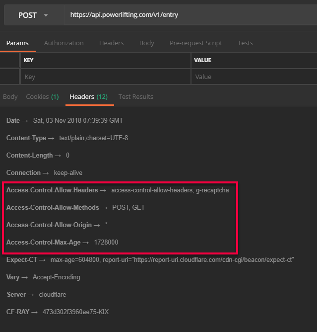
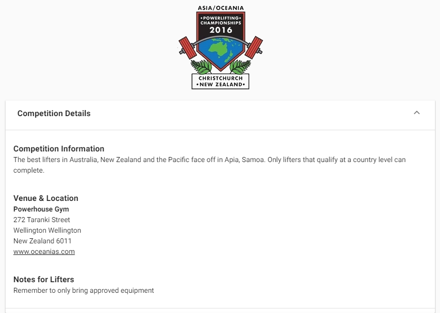
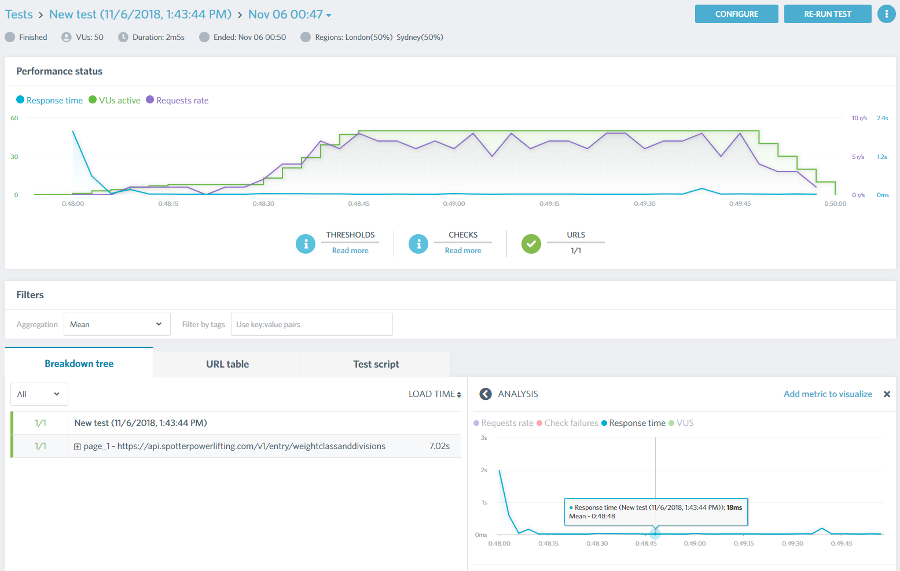

###### Photo by [Casey Horner](https://unsplash.com/photos/39-4uKLsVnw?utm_source=unsplash&utm_medium=referral&utm_content=creditCopyText) on [Unsplash](https://unsplash.com/collections/3351204/mountains-and-cliffs/7c72ed4c4c766861c5f3f350646b752b?utm_source=unsplash&utm_medium=referral&utm_content=creditCopyText)

Let's go over how I built an API and data storage that exists purely on the edge. It looks and feels like a REST API but everything is done with Cloudflare Workers and KV.

# Entry Form Demo App

I originally planned to show you how I transformed an existing API to use Workers and KV but it was complicated and time consuming to explain everything.

Instead I decided to write a simple application: an entry form for a powerlifting competition. Why powerlifting? It's the sport [I train for](https://twitter.com/bcnzer/status/1057015851495215104).

The idea behind this app is: if you want to compete you need to submit an entry form. The form can also show basic information about the competition.

A few things to point out:

- **Concepts**
    - You must first select a Gender before you can select a Nominated Division and Nominated Weight Class
        - Division is your categorization by age
            - For example: Master 1 is for people 40-49 years old
        - Weight class is your categorization by body weight
            - For example: 105 kg class is for males between 93.01 kg and 105 kg
    - Every field except for the three Personal Bests, at the bottom, are required
- **Technical details**
    - App is a Vue.js SPA. [Here is the template I used](https://github.com/vuetifyjs/nuxt)
    - Form uses [Google invisible reCAPTCHA](https://developers.google.com/recaptcha/docs/invisible)
        - There is no "I'm not a robot" checkbox but you may be asked to verify some images.

Below are pictures demonstrating the Nominated Division, Nominated Weight Class and reCAPTCHA.

 

\[gallery ids="4927,4929,4928,4930,4931,4932" type="slideshow"\]

### Nominated Divisions and Weight Classes?

When a lifter signs up they must _nominate_ a weight class and division.

- The division it's easy - it's based on age and it's like saying "on this day I'll be a 40 years old so I'll be a Master 1". Some competitions are only open to people of a certain division
- The weight class is what your body weight _will_ be on the date. This can be important for many of the more serious competitions.

# GET Endpoints

There are two GET endpoints in my API:

1. **Competition information**, which retrieves things like the address and logo
2. **Weight classes and divisions**. The definitions I'm using is from the [International Powerlifting Federation](https://www.powerlifting.sport/) (IPF).

Both methods will need to perform four tasks:

1. Handling OPTIONS / CORS
2. Accepting the GET request
3. Getting the data from KV storage
4. Returning the response

## OPTIONS verb

When you hit an API with curl or Postman it's going straight to the endpoint.

The browser is different. It will often send an OPTIONS request (it's a HTTP verb, like GET or POST), which effectively asks what the permissions are. This can include what headers or origins are allowed. [Checkout this blog post for more info](https://wanago.io/2018/11/05/cors-cross-origin-resource-sharing/).

Below is how I've chosen to handle the OPTIONS requests, starting at line 18. You can see an example response in Postman (next picture).



### GET - Competition Information

Every competition has the basic details entered into KV.  The format is:

- **Key** = competition ID i.e. 17043
    - When users come to the entry form they will be doing so with a URL like this: `powerlifting.com/entry/17043`. I'm able to extract the competition ID from the URL
- **Value** = data in JSON format.
    - [Click here](https://gist.github.com/bcnzer/5a370d04042831c459792905e02a7486) to see what the JSON for this competition
    - Remember there is a 64 KB limit per value but, in my case, I'm well below it.

The competition information is primarily displayed as the top of the form.

The code for the GET method starts at line 29 (below). The code:

- confirms it is the URL we are looking for
- gets the data from KV
- returns it along with specific headers

Note that, on line 35, we are returning the same headers we had in our OPTIONS header. If you forget to do this the browser will fail and say something about [CORS](https://developer.mozilla.org/en-US/docs/Web/HTTP/CORS).



### GET - Divisions and Weight Classes

I wrote this two ways.

#### Method 1

I originally thought I would call the GET method each time a person changed the gender. I wrote two endpoints - one for divisions (line 45), the other for weight classes (line 50)

I then added logic to confirm the parameters were valid, plus some smarts.

Later I realized this wasn't efficient so I decided I would call it once, to get all the data, and store in memory on the browser.

I decided to keep the code as demonstrates, quite nicely, what you can do.

#### Method 2

Checkout line 39. I have all the data stored in a single key called `ipf2018`.



# How to structure my data in Workers KV?

With the Competition information, it was obvious I would store one entry per competition.

Divisions and weight classes weren't so obvious. The four options I had were to:

1. Each record gets a KV entry. I could have 31 entries
2. Store by gender and type (division vs weight class)
3. Store by gender
4. Store it all in one key

I discovered a worker can make up to 50 requests to anything (fetch or KV). As such, fewer requests is better.

I noticed the reads to KV could be very fast - but only if they were warm (being read more than once a second). The cumulative affect of reading lots of cold records could result in it being slow overall.

Lastly, I realized all the data I had took up less than 5 KB, well below the 64 KB limit. It made sense to put it all in one key. I could splice up the data in the Worker on the client, which was quick (especially as I didn't have much data and it was simple).

Summary: better to minimize requests to KV and make full use of the 64 KB limit for each KV entry.

# Quick Load Test

The following is a quick load test for the get divisions and weight classes endpoint. I'm hitting the API from Sydney, Australia and London, UK.

My response time is 15-40 ms, which is just amazing.

# Next Step

In the [next blog post](http://liftcodeplay.com/2018/11/06/pushing-my-api-to-the-edge-part-4-post-and-recaptcha/) I'll be talking about how I implemented a POST method along with reCAPTCHA in my Worker. I'll also load test everything in more detail.
