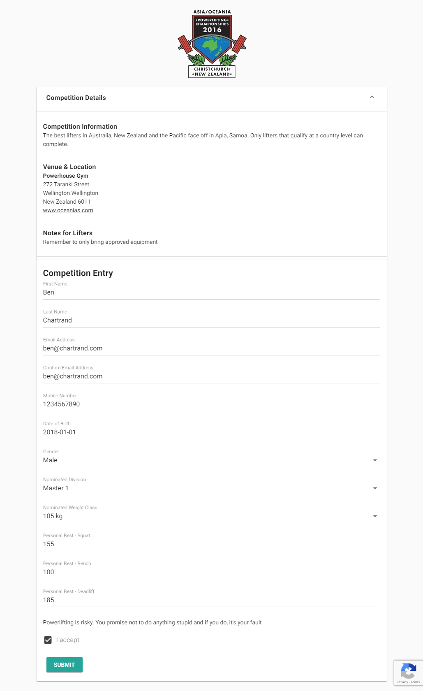

###### Photo by [Theodor Lundqvist](https://unsplash.com/photos/Vsn5YH9sMeA?utm_source=unsplash&utm_medium=referral&utm_content=creditCopyText) on [Unsplash](https://unsplash.com/search/photos/mountain?utm_source=unsplash&utm_medium=referral&utm_content=creditCopyText)

In the [previous blog post](http://liftcodeplay.com/2018/11/05/pushing-my-api-to-the-edge-part-3-moving-my-gets/) I demonstrated how to implement GET methods and have their associated data all on the edge.

In this post I'll be showing you how I implemented a POST method for the form and reCAPTCHA.

# Quick Recap

We have a simple form, which allows a competitor to enter a powerlifting competition. Right at the end of the form is a submit button.

## reCAPTCHA

We've likely all seen a form where we have to enter an obscured code. This is CAPTCHA (aka version 1).

Alternatively, we may need to click a check box that said "I am not a robot". This could result in you being asked to answer some questions, such as where you can see pictures of a bicycle. This is reCAPTCHA (aka version 2).

In my form I'm using [invisible reCAPTCHA](https://developers.google.com/recaptcha/docs/invisible). Despite the name you can see the small logo in the bottom-right of the window. The upside is there no "I am not a robot" checkbox.

\[caption id="attachment\_4932" align="aligncenter" width="759"\] Example of reCAPTCHA in action\[/caption\]

# Architecture

A traditional way of writing a form like is:

- Press submit
- Send a request
- Wait for it to respond. This could take a while...
- Response received so refresh the UI for the user

In some cases that's not a big deal. In others, like purchasing of airline tickets, the process behind the scenes is complex and time consuming. That's why you will often see a message saying _please press submit only once_.

## Asynchronous POST

If ever you've purchased something from Amazon you'll notice that the time between your confirmation of the order and Amazon's confirmation message is very quick. Amazon is merely _acknowledging_ your order. The processing and confirmation of your order comes later.

I want to do something similar - I want to build a largely asynchronous workflow.

Using the Worker to process the POST request will result in a low latency response. I also avoid the potential cold start issue of calling my Azure Functions backend (if I was instead using an HTTP triggered function).

The asynchronous part of the POST comes when the Worker is done and places the message onto a queue. At this point the message can be handled by multiple subscribers to do things like:

- Write to the database
- Write an audit trail message
- Send to an email to the user
- Send an SMS to the user
- Send a websocket message to the competition manager

[Azure Functions](https://docs.microsoft.com/en-us/azure/azure-functions/functions-overview) works great for the above. I can easily setup small, discrete functions or even build whole workflows using [Logic Apps](https://azure.microsoft.com/en-us/services/logic-apps/).

## Process

This is how my form works:

- User fills out the form and presses **Submit**
    - Form validation occurs. If there are errors the form highlights the issue and stops
    - User may be required to answer reCAPTCHA questions
    - reCAPTCHA token is generated
    - POST request is sent
- Cloudflare Worker intercepts the POST request
    - Validates the request body (again)
    - Confirms the reCAPTCHA token is valid by calling a Google API. It not, throws an error
    - If it is valid it submits the request to a queue for processing
    - Returns a status code **202** accepted

# Code

**Line 52** is where the fun begins. Assuming it's the URL we were expecting, it then validates the form.

The form validation is relatively straightforward. I imagine there could be better ways of doing this but I'm trying to use plain Javascript (to avoid using an NPM package) and the code below is similar to my front end validation rules (at least the regular expressions).

**Line 59** is where I get the reCAPTCHA token I placed in the header. Note how I explicitly allowed that header value in line 123.

**Line 65** is where I get the reCAPTCHA secret Google generated for me. It's ok to keep this value in KV as the data is encrypted at storage and at rest.

**Line 66** is where I'm verifying the token. This is pretty quick.

Assuming that's ok then on **line 73** - that's where I'd submit the data to a queue. Note I haven't shown an actual implementation but it's usually as simple as calling a REST API.

**Line 80** is where I return the 202 status code.

https://gist.github.com/bcnzer/5911b9375df24489ad327fecf6e4878c

# Conclusion

This is the end of this blog post series. If you've found it useful or have any questions please post a message in the comments.
