1,000 hours is not an exaggeration. It's based on tools I used to track my time. The actual number is likely much higher.

The following is a tale of how I used my side project to invest in and reinvent myself. It was an attempt at software craftsmanship which ultimately lead to a sad goodbye.

## Origin

It's 2014 and I decided to take my weight lifting to the next level and join the local powerlifting association. I competed on a few occasions, mostly at novice competitions.

I offered to help as they were always in need of volunteers. It also provided me an opportunity to learn more about the sport.

One day the organizers asked me to "run the computer" at a local novice competition. That meant using their program to run the competition. Turns out it was an Excel spreadsheet, full of macros, called [NextLifter](http://www.nextlifter.com/). It's still in use today.



Sample of NextLifter, which is an Excel spreadsheet that makes heavy use of macros

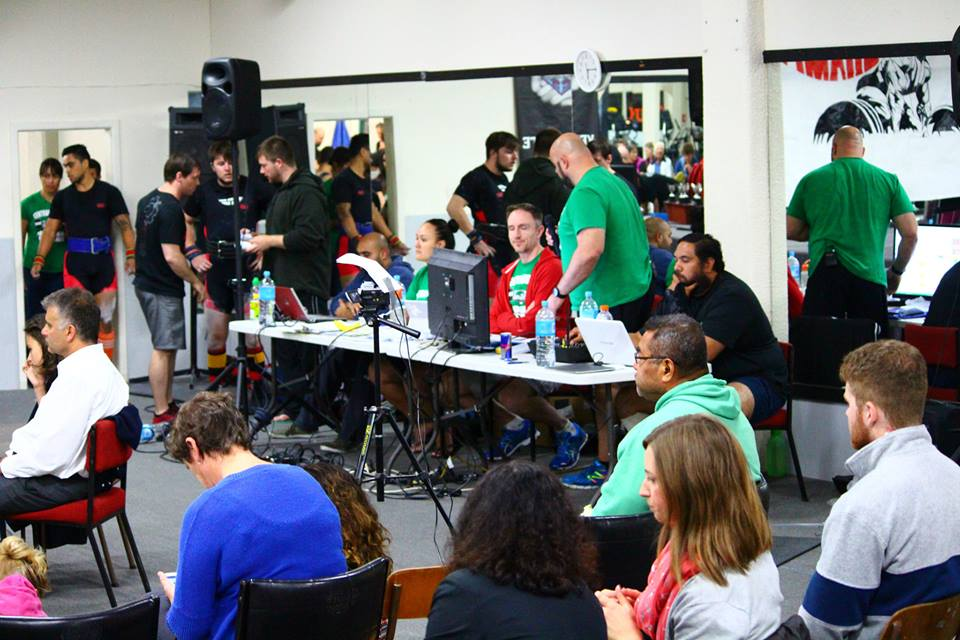

Me running the computer. I'm wearing the red shirt at the desk



The spreadsheet in action at the same comp

### Disaster Strikes

Shortly after we began a young woman asked me if I could fix her name. The first and last names were backward.

I made the change then the Excel sheet started throwing errors and showing debug dialogs.

**The competition came grinding to a halt.** I was horrified.

Thankfully we had everything written on paper (there's always a paper backup) so we managed to run on that but it was painful.

On the ride back home I decided to take a crack at replacing this @#$@#$@#$ spreadsheet.

My motivation ever since then has been to build something to help my friends and make life easier for volunteers.

## What to call it?!?

I hate naming things but when you start a new project, it's the first thing the tools ask. I initially gave it a code name: _Project Loki_.

I then settled on a name of **_Spotter_**. I felt the name was apt as a spotter is a volunteer whose job it is to help you with the bar if you're struggling to complete your lift. You could say they've got your back.

All the guys in white are spotters, ready to grab the barbell incase the lifter can't get it up

## Time

I'm usually on free between 8 pm and 10:30 pm - once the kids are in bed. Sometimes a bit earlier and sometimes a bit later.

Before I started this project I mostly spent my time spare gaming. The start of this project roughly coincides with the realization of how much time I was spending wasting on gaming.

Admittedly it was hard, at first. Gaming is easy, fun and relaxing. All this coding felt like a different form of work and could be very frustrating, especially as I was learning.

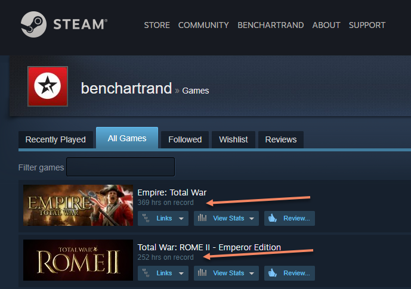

Screenshot from Steam. These numbers shocked me

Its worth noting that I still occasionally play games but not as often and they're usually casual games. For example: I might play something for 30 minutes and then I'd stop to write code at 8 pm.

### Tracking my Time

My employer once told me I was not to work on anything in my spare time. I remember that conversation well and how ridiculous it was.

I decided to use a tool called [WakaTime](https://wakatime.com/). It installed into [Visual Studio](https://visualstudio.microsoft.com/) so it could track my time spent. I thought that, worse case, it would be proof I only worked on my project in my spare time.

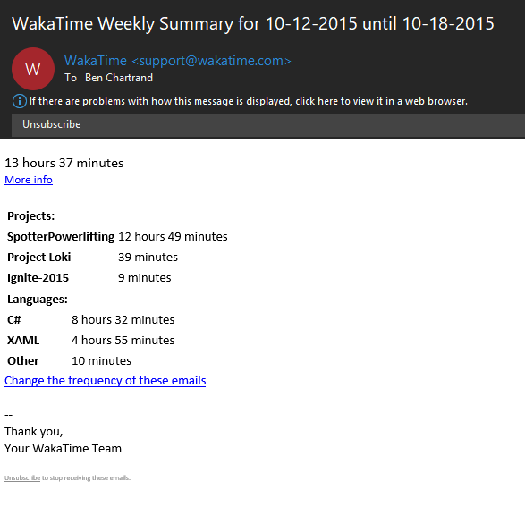

Sample weekly email from WakaTime

I forget how much time I logged in WakaTime. I remember showing my friends a screenshot when I was over 100 hours. I'm pretty sure it was well into the hundreds of hours (300? 400?) by the time I got rid of it.

In Nov 2016 I realized Wakatime had not been tracking my time for ages. In frustration I cancelled my subscription and went with a tool called [Codealike](https://codealike.com/). I'll show you some screenshots from Codealike, which I had archived.

BTW, worth stressing I didn't put in time every day. There were also long periods of time where I didn't write any code, primarily around the Christmas break.

## It begins. Version 1 - WPF

> This will be easy. I'll get it done in no time.
> 
> Me. Famous last words

I wanted to provide a self contained program - something that ran on their PC. I chose to use [WPF](https://en.wikipedia.org/wiki/Windows_Presentation_Foundation) (Windows Presentation Framework) and a framework called [Mahapps](https://mahapps.com/). This combo is what GitHub used for their original Windows desktop client.

I wasn't familiar with XAML but I learnt it along with a bunch of other tools and frameworks, such as SQLite and Entity Framework.



Screenshot from July 2015

Progress was slow. Aside from learning all this new tech I was also diving into the details of the sport, which is surprisingly technical and complicated.

## Version 2 - UWP

> This will be awesome! I'll get this done by the next big comp
> 
> Me. Still wildly optimistic

Windows 10 was coming, as was the Windows Store. Around Oct 2015 I decided to switch to [UWP](https://docs.microsoft.com/en-us/windows/uwp/get-started/universal-application-platform-guide), which used a form of XAML. This meant I could tweak my app and have it delivered via the Windows Store.

A major challenge was that I lost MahApps. No UI framework goodness. I had to do it all myself and I struggled with the UI.

That said, I did progress my project and built some pretty cool things. One was this [blade UI](https://liftcodeplay.com/2015/11/12/design-pattern-blades-for-sequential-data-entry-wizards-in-uwp/) control, which is similar to what is used in the Azure Portal. It later got picked up by others and made into a generic control called [BladeView](https://docs.microsoft.com/en-us/windows/communitytoolkit/controls/bladeview) in the [UWP Community Toolkit](https://docs.microsoft.com/en-us/windows/communitytoolkit/).

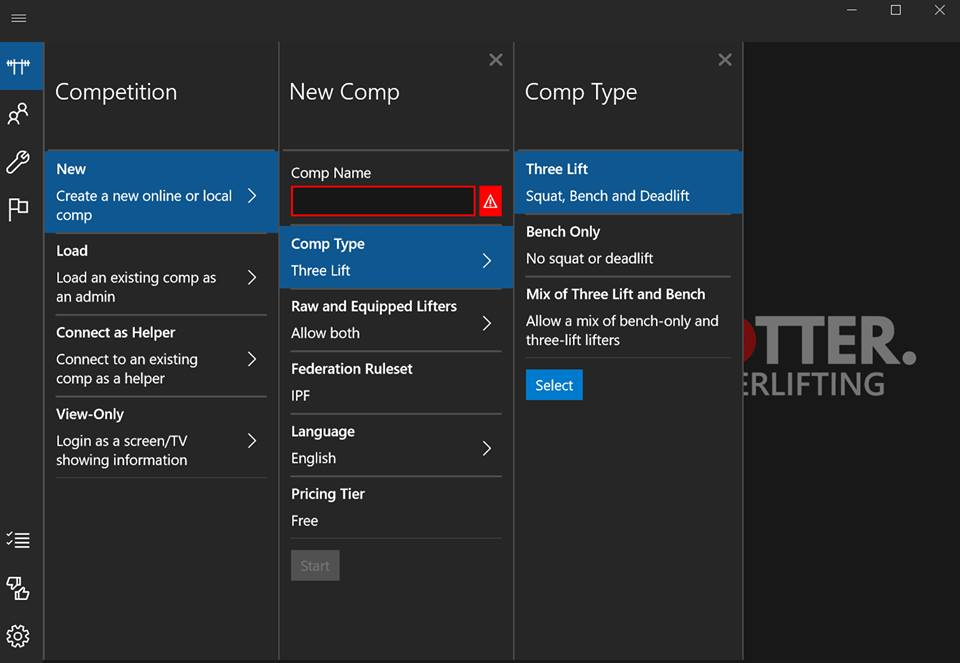

My implementation of the Blade control. Pretty snazzy

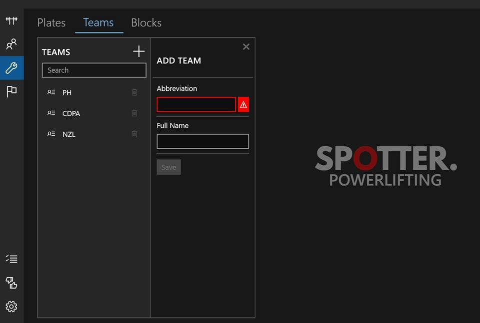

Another example - this time in the definition of Teams

### What do you mean I can't deploy to the Store?!?

Things were moving along nicely. I wanted to give a beta version to my friends via the Windows Store.

As a first step I built my app in Release mode. It was taking ages... and it eventually crashes. Over and over again it happens.

I raised an issue directly with the team at MS, who gave me a largely underwhelming answer. I was stuck - I couldn't move forward. I could never deploy my app!

And I was pissed. I swore off UWP.

To date my friends hadn't said anything but I could tell they weren't interested in a Windows desktop app. They had Macs, iPads, etc. Plus there was a need for inter connectivity. Time to make the leap into a web based version

## Version 3 - ASP.NET Core

> Gonna be the best version yet! I'll have it done before the start of the lifting season
> 
> Me.

I decided to use ASP.NET Core and write an MVC app. ASP.NET Core was open source, cross platform and, at the time, very new - early betas.

It was slow going at first and I got to experience some of that early-adopter pain but I made steady progress. This felt new and exciting.

When it came the screen that actually ran the competition I realized I needed to use some Javascript. That's when I fell in love with Vue. It was such a joy to work with. I wanted to do more with Javascript.

At this point I had clocked up some serious hours in Codealike, as seen below.

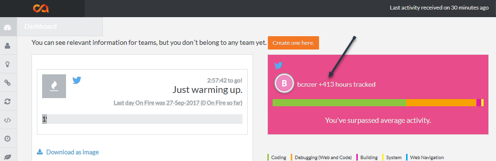

Codealike showing 413 hours tracked as of 27 Sept 2017

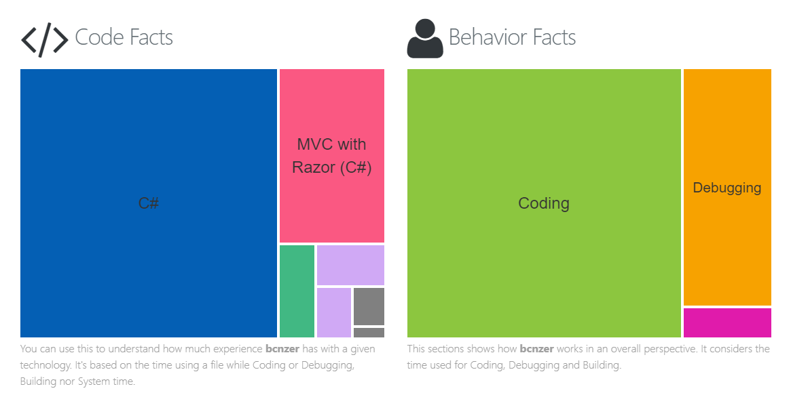

Some code and behaviour facts from Codealike

I also submitted [my first PR](https://liftcodeplay.com/2017/01/04/my-first-pr/) to an open-source project - the ASP.NET Core docs!

## You want to be CTO?

Remember how I mentioned my employer - the one that didn't want me spending time coding on the side? That same employer offered me the role of CTO (Chief Technology Officer).

All those things I learned which I learned in my spare time, I brought to work but I never mentioned my project.

It's as if they quietly realized I knew a great deal. It was also clear I was the only one investing (bothering?) in learning new tech.

At first the title was little more than an honorific (helped when dealing with vendors) but, over time, it came with the power to introduce change.

An example is git. For years we used a legacy, SourceSafe-like tool. I moved everyone to git and Visual Studio Team Services (now known as Azure DevOps). All that real-life knowledge and experience was invaluable.

## Version 4 - Vue.js SPA + ASP.NET Core API

> I'll finish this eventually. But, when I do, it'll be awesome!
> 
> Me

I loved working with [Vue.js](https://vuejs.org/). I also discovered the joys of [Visual Studio Code](https://code.visualstudio.com/). I decided to re-write my app as a Single Page App (SPA) with a pure ASP.NET Core API.

That was a big leap. I knew nothing about modern Javascript, Node and NPM. It was another case of adopting new technology, taking time to get productive and to eventually get back to where I was previously. But it was worth it.

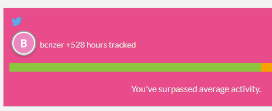

528 hours tracked in Codealike... and growing!

Working with ASP.NET Core for the API was great but the thought of hosting the API bothered me. I wanted to avoid paying anything if I possible. I was writing an event application so there could be periods of time with zero traffic and other times where there is heaps.

Then I heard about this magical stuff called serverless and, specifically, [Azure Functions](https://azure.microsoft.com/en-us/services/functions/).

## Version 5 - Vue.js SPA + Azure Functions API

> This tech is so amazing. The extra delay will be totally worth it.
> 
> Me, starting to be realistic about time frames now

Around the time Azure Functions first came out I started playing with it. I realized I could write my whole API using it!

That was great but some of the things I wanted to do was not straightforward in Azure Functions. For example, I wanted to do JWT validation via Auth0. It was painful but I figured it out and even created a [demo app](https://liftcodeplay.com/2017/12/20/wolf-tracker-vue-js-azure-functions-more-for-a-secure-cheap-highly-scalable-spa/) which showed how it all worked.

I was having great progress and devised an amazing architecture, involving CQRS, that should have kept my costs low (less than $20 / month). What was especially amazing at this period of time is I learned more about architecture. One of my favourite books became the [Cloud Application Architecture Guide](https://azure.microsoft.com/en-us/campaigns/cloud-application-architecture-guide/).

I also experimented quite heavily with [Cloudflare Workers and Workers KV storage](https://liftcodeplay.com/category/cloudflare/) which was serverless and storage service at the edge.

Sometime around this time is when I realized Codealike hadn't been tracking time for ages, especially from VS Code. In annoyance I ditched it. The following is the last screenshot I could find. Worth stressing the actual hours were a lot higher.

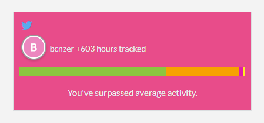

This is the last screenshot from Codealike

## Version 6 - Vue.js + Nuxt and Firebase

> Maybe my friends will have forgotten I'm still working on it? Oh well - they'll get it when they get it.
> 
> Me

With my Vue.js SPA I decided to re-write it using [Nuxt](https://nuxtjs.org/) and to componentize my user interface. The previous version had no components so some screens were a mess.

Around the same time I came to the conclusion that my Azure Functions was a bit of a pain. My pain was self inflicted as I had over-engineered my backend.

A friend suggest that my app would suit a NoSQL store. His words kept ringing in my head.

I decided to make the leap into [Google Cloud Firestore](https://cloud.google.com/firestore/). At the time Firestore was in beta but it was a joy to use, it was even cheaper than what I had previously, it came with auth and - best of all - my dev was all Javascript.

I did some pretty neat stuff with Firebase and IndexedDb (via [Dexie.js](https://dexie.org/)) - essentially using IndexedDb as a local cache and having the real time update from Firestore to push updates to it. It was a fantastic for my use case. I had planned to use IndexedDb as part of my offline solution, with service workers.

I was really happy with my progress. Everything was coming together and looking fantastic.

I was taking what I would call a "Dyson" approach. I wanted to build something fantastic - as good as I could make it. This was intentional as I was building it for volunteers who knew nothing about the sport. This is a contrast to a more "Agile" approach, which is to build something minimal and ship it.

For example: let's say there's 35 lifters. You can't have them all lift one after the other. You break them up into groups called _Flights_. Trouble is there's specific rules/logic in creating flights such as:

- women go first
- smallest opening lift to heaviest
- no more than 14 lifters per flight

NextLifter assumes you can do this manually. I can attest that, as a volunteer, this is a nightmare.

With my app you press a button and it did for you. Afterwards you could drag and drop lifters to manually adjust the order.

Below are some screenshots - some highlights. What these screenshots don't show are all the loading effects, transitions and more. Also, to create an account you could use your email or Google account. All requests to Firestore had authentication/authorization.

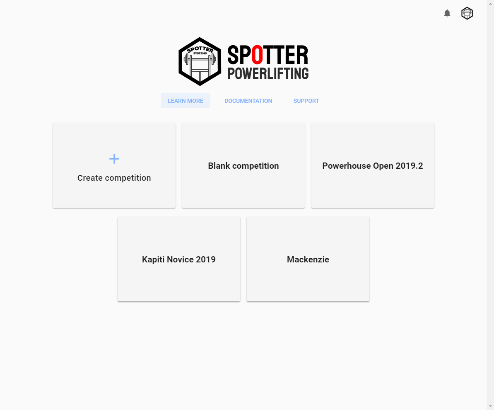
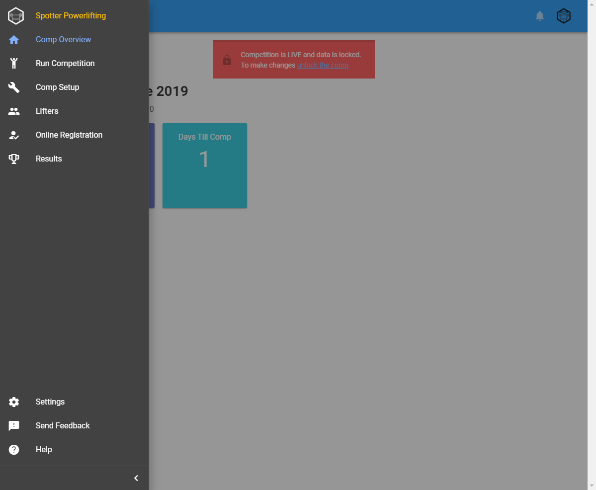
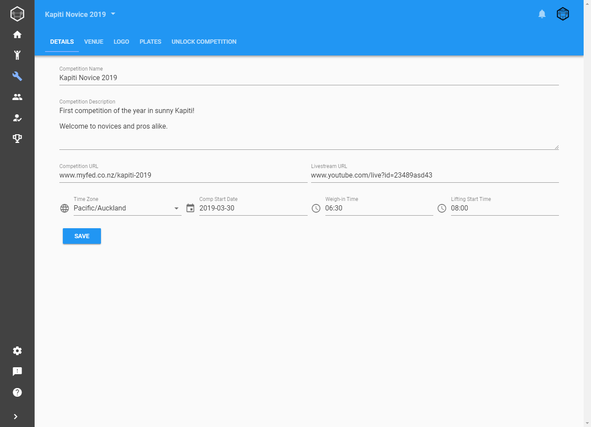
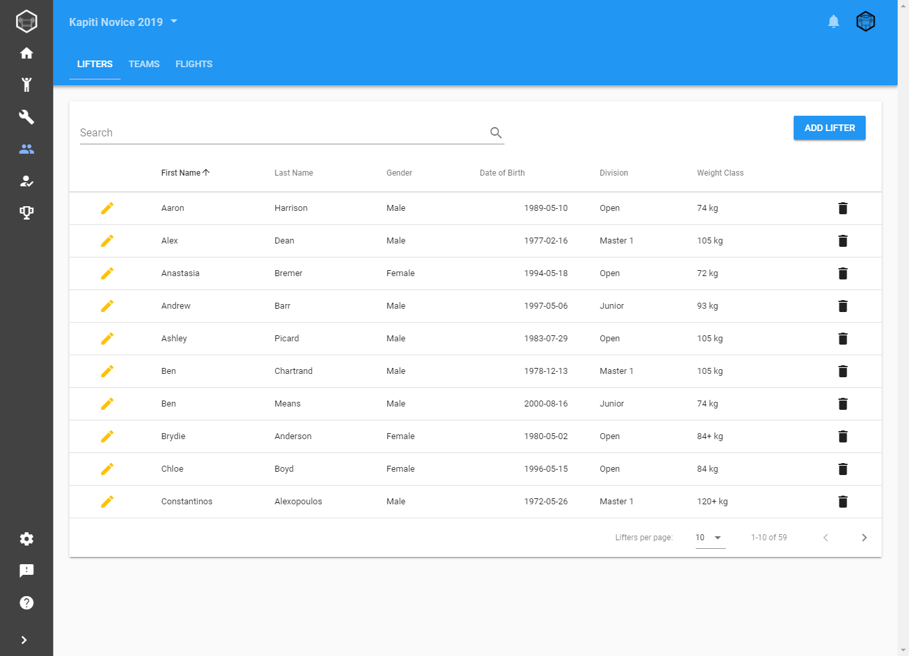
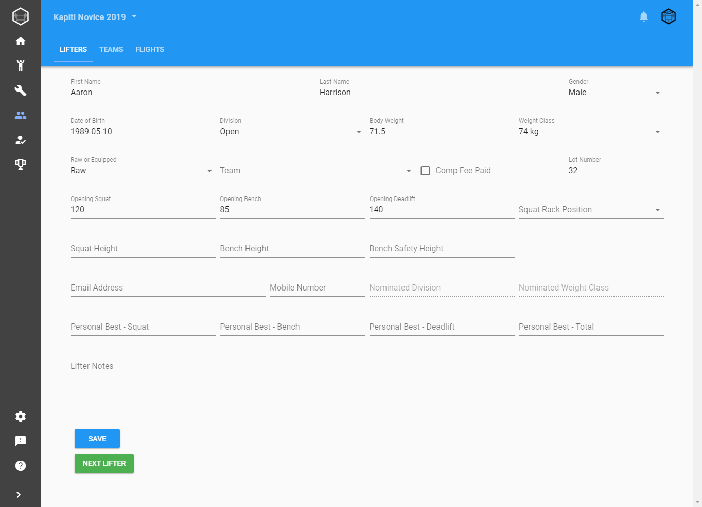
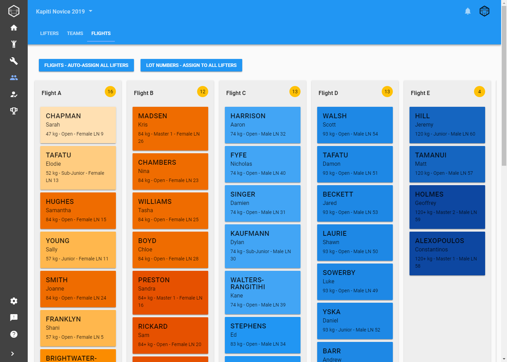
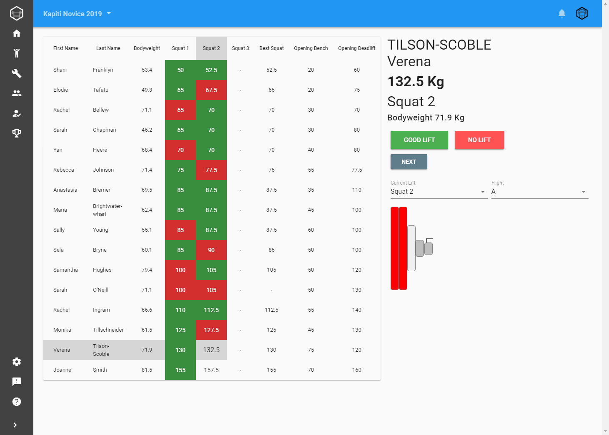
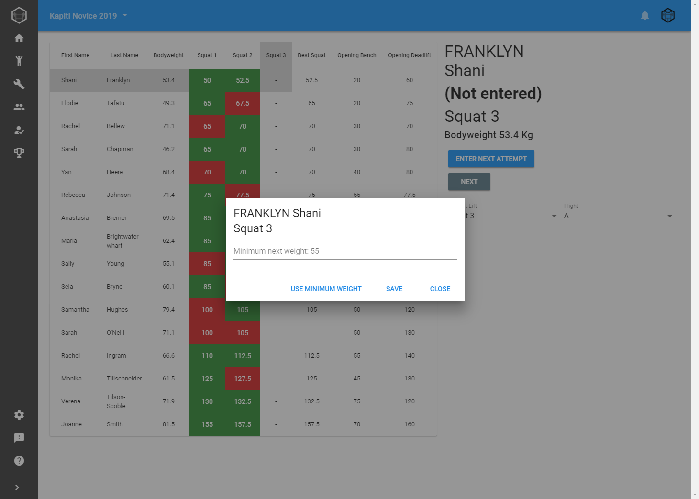

## And one day I stopped working on it

I got a message from a friend about [OpenLifter](https://gitlab.com/openpowerlifting/openlifter). It's made by the same team that produced the crazy-fast [https://openpowerlifting.org](https://openpowerlifting.org) site.

Their app is meant to be a replacement of the spreadsheet. It's local-only and built using [Electron](https://electronjs.org/).

My approach was more about being online-first, to work on any device and to be as user friendly as possible.

When I looked at their code I was amazed. In a few months they had built so much. Worrying for me was the realization there was a heap of complexity I hadn't even begun to cater for.

For example: in really big competitions lifting can be broken up over multiple days and lifting can happen concurrently on different _platforms_. Spotter couldn't handle this. There were so many more examples.

Recently, I put a lot of spare time into my app thinking I was so close to being done. I came the realization I had SO much work and complexity ahead of me.

I couldn't even begin to match their velocity. I'm one person. They appear to be 4+ people working on it. Plus I'm always diverting to explore new tech, write blog posts and more.

This lead to some some painful soul searching. I decided to finally put this project aside. I made one last commit entitled `final commit` and pushed it.

Remember how I mentioned 1,000 hours was my conservative estimate? I think the real number is closer to 1,500 hours but I have no way of confirming.

## Don't cry for me... 'cause I learned so much

I can't stress enough how massively influential and beneficial this project was to my career. I reinvented myself through this project and continue to do so.

I mentioned how I became CTO. Here's two other recent examples:

- All that knowledge of serverless (Azure Functions and Cloudflare Workers) lead me to
    - Doing [six talks in 2018](https://liftcodeplay.com/talks/). That includes two talks at Microsoft New Zealand and one at a major conference
    - Being interviewed for a podcast episode to discuss serverless, architecture and more.
- As I was interviewing at my current employer they asked for code samples. I showed them my side project - the ASP.NET Core code, my Azure account, VSTS CI / CD pipelines and more.

I'm now considered the DevOps and serverless guy at work.

I also wrote a [heap of blog posts](https://liftcodeplay.com) over time, as I learned.

### Opportunities

Many of us choose roles / employers that provide the opportunity to grow and learn. Unfortunately those opportunities can be limited in number and duration.

With this project it felt like I was making my own opportunities. If I wanted to learn about something I just went ahead and did it. It helped that I had no customers so I was only accountable to myself.

### Growth Mindset

I realized it was vitally important to have a [growth mindset](https://www.mindsetworks.com/science/). The image below explains it well.

The first time I started out it was so painfully difficult. The hardest part was initially accepting I had to make a change and that I was behind, tech wise (former employer had a lot of legacy tech).

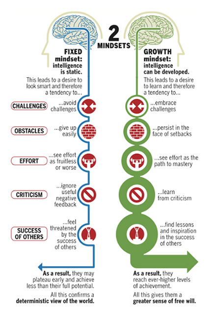

### Like-minded people

As I was working on my project I made use of Twitter. I was able to talk to and learn from experts and with other, like-minded devs. I really value the connections I've made with people over time.

In my current role, I've really enjoyed talking to my coworkers about what they do - to learn more from them. For example: I was blown away when I learnt about the world of SEO and design. I like to consider myself a _Junior Honourary FED_ (Front End Developer). I took what I learnt and tried to apply it in my project i.e. using Google Tag Manager.

I've also enjoyed sharing what I've learned in my spare time with my coworkers. It's great working with people that are open to the occasional question and willing to listen, even if it's just me sharing an accomplishment that they would understand/appreciate (i.e. hey, I got offline working!).

At work I've also run "lunch and learn" sessions to discuss things topics such as Azure Functions and my use of Cloud Firestore.

## Where to from here?

With Spotter, I have no plans to work on it it again. I may open source it one day soon.

I love to learn. I have a huge "to learn" list. I'm thinking of building some smaller projects to explore tech / concepts such as [PWAs](https://developers.google.com/web/progressive-web-apps/). Spotter felt like this never-ending beast of a project so I'm keen to complete projects.

I want to push myself further out of my comfort zone and away from the realm of what I know. For example: I want to learn Rust and work exclusively in a Linux environment.

I'd also like to get involved in open source, as a contributor, and to open source more of my projects.

There's so much more I want to do. I'm looking forward the next 1,000 hours!
