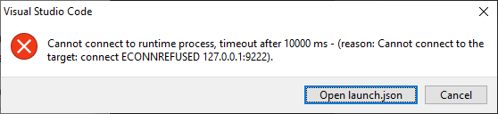
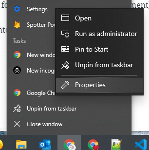
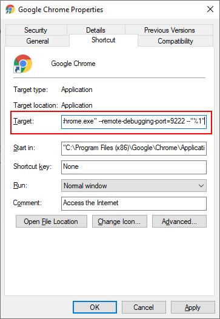
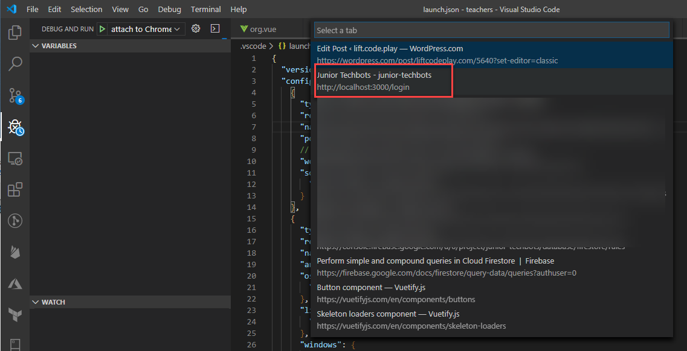
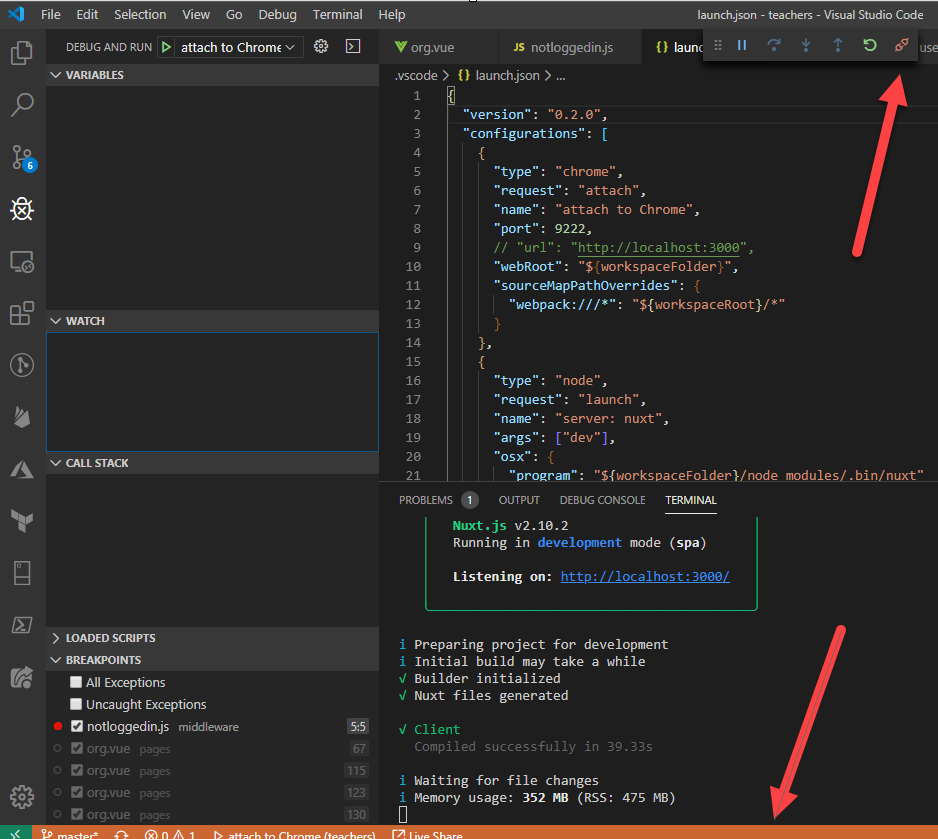

I started a new project with Nuxt.js and Firebase. All went well till I wanted to debug in more detail... and it didn't work. I found [this excellent article from Les Harris](https://medium.com/js-dojo/debugging-nuxt-js-with-vs-code-60a1a9e75cf6) but it didn't work for me either.

The following is a quick guide on how to put it all together.

## Pre-requisites

- Chrome
- Visual Studio Code
- VS Code extension: Debugger for Chrome
- [Nuxt.js](https://nuxtjs.org/) project

Included is a Nuxt.js project I created using `yarn create nuxt-app <project-name>`. [Here's the source](https://github.com/bcnzer/nuxtjs-debug-vscode-chrome).

Worth noting I chose to create a Single Page App but I'll also explain how to use it for a Universal SSR (Server Side Rendered) nuxt app.

## Two methods of debug configuration

With VS Code and the Debugger for Chrome extension there are two methods of debugging:

- Attaching to an existing tab
    - **Advantage**: you can connect to an existing tab
    - **Disadvantage**: you need to tell Chrome to startup with a specific port for remote debugging
- Launching a new Chrome window
    - **Advantage**: it's a new, seperate window
    - **Disadvantage**: it's like an incognito window so you lose context, history. Can be particularly annoying if you have authentication

My preference is with the fist method. It's a bit more effort up front but is more effective.

# Method 1: Attaching to an existing tab in Chrome

## Add the launch.json

To debug in VS Code you need a `.vscode/launch.json` file.

Create the file yourself under `.vscode/launch.json` or go into Debug and click the button for it to create a default one for you (you'll overwrite it in a moment).

Once it's there copy the following into it.

https://gist.github.com/bcnzer/7b0264b523d18a64f60d07fff87fb982

Your app can run in development mode on any port other than port 9222.

## Launch Chrome with Remote Debugging Port

If you go into VS Code and try to run the debugging, by attaching to Chrome, you will get a timeout message.

To fix this you need to launch Chrome with the parameters for remote debugging.

In my case, in Windows, I could

1. start up Chrome from the command line like this \`chrome.exe --remote-debugging-port=9222 --"%1"\`
2. (Preferred) set the remote debugging port to always be set whenever I click the Chrome icon. See the pictures below

## Debugging

### Step 1

As mentioned above, make sure Chrome is started up with \`--remote-debugging-port=9222 --"%1"\`.

I chose to make it permanent to avoid having to remember this step.

### Step 2

Run `yarn dev` to start the application.

Make sure the site open in chrome i.e. at `http://localhost:3000`

### Step 3

Go into `Debug and Run` and start the `attach to Chrome` profile. 

You will be asked which instance you want to debug. Pick your tab

When you're successfully attached the bottom part of VS Code turns orange and the wee debug menu that pops up has a red/orange **disconnect** button.

### Step 4 

Place whatever breakpoints you want in VS Code and have fun debugging!

Note that if you have a Universal SSR app you'll need to start the `server: nuxt` debug profile instead and set the appropriate breakpoints.

# Method 2: Launching a new Chrome Window

## Add the launch.json

To debug in VS Code you need a `.vscode/launch.json` file.

Create the file yourself under `.vscode/launch.json` or go into Debug and click the button for it to create a default one for you (you'll overwrite it in a moment).

Once it's there copy the following into it.

https://gist.github.com/bcnzer/cb05d6bb088760811f366d54cbd8f7f4

## Config in nuxt.config.js

Open your `nuxt.config.js` and find the `build` section, near the bottom. You want to add to the `extend` function as seen below

https://gist.github.com/bcnzer/5f4761d862ffb1088681bdb1bf3fae44

## Debugging

### Step 1

Run `yarn dev` to start the application.

Make sure the site open in chrome i.e. at `http://localhost:3000`

### Step 2

Place whatever breakpoints you want in VS Code, then attach the debugger by:

- In VS Code, click the `Debug and Run` (bug icon) on the toolbar
- Select either `client: chrome` or `server: nuxt` debug profiles and click the run button
    - In my case, I have a SPA so I always select client.
    - If the application is Universal, set breakpoints and then use whatever profile is appropriate

Voila - it works!

## Why does this work?

We're doing a few things:

1. The Debugger for Chrome extension allows you to attach to your existing Chrome instance
2. The `launch.json` and change in the `nuxt.config.json` both are changed to use the source files. For example: in the `launch.json` the `sourceMapPathOverrides` is important to specify those source map paths. Without this your breakpoints will not seem to match up where your code is (the debugger will seem very broken).

Note that you can use the same for Firefox. There's an equivalent extension for VS Code.
