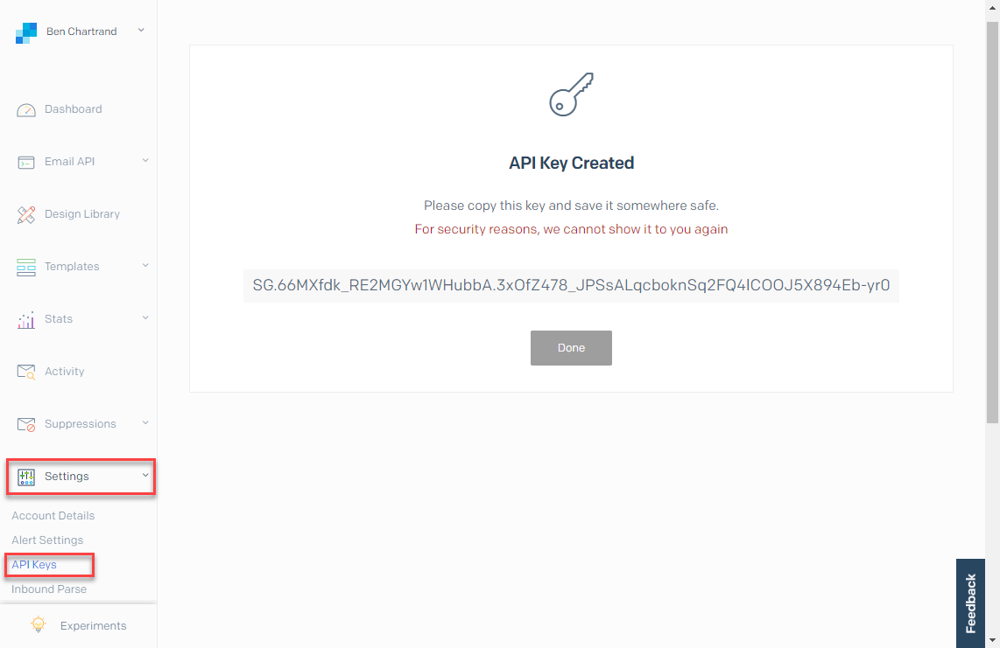
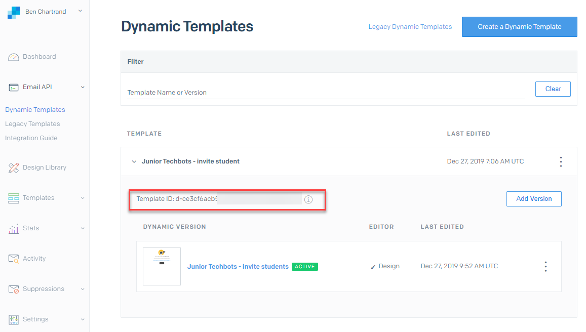
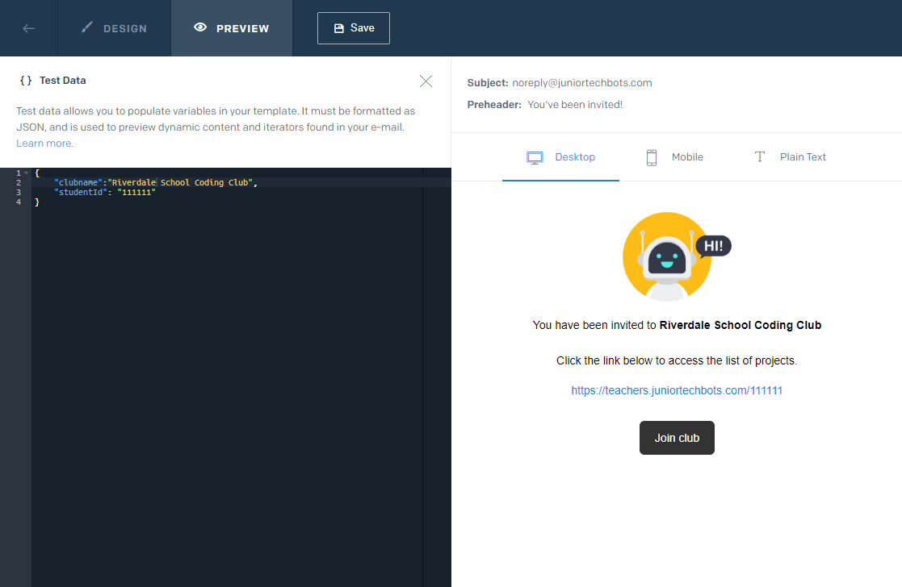
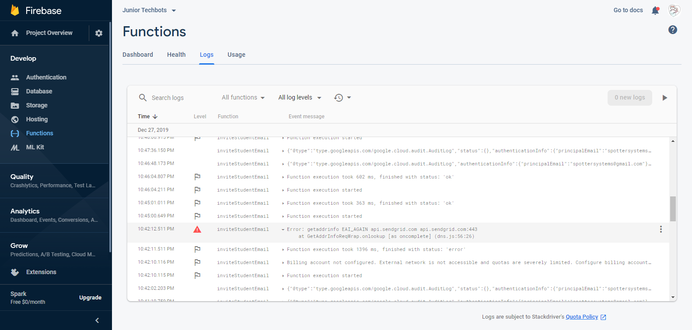

Let me show you how you can write a Google Cloud Function, as part of a Firebase project, to send an email with SendGrid. The email sending process will trigger on writing a record in [Google Cloud Firestore](https://cloud.google.com/firestore/).

There are plenty of posts and videos that explain this but all of them are missing key details or are out of date.

## Prerequisites

- [Firebase](https://firebase.google.com/)
    - An account setup
    - [Firebase CLI](https://firebase.google.com/docs/cli) installed
    - Application created within Firebase
    - The above application must be set to the Pay-as-you-go plan
- [SendGrid](http://sendgrid.com/) account
    - **Tip**: if you use Azure you can get a free account, via the Azure Portal, that gives you 25,000 emails per month. Otherwise if you create a free account directly on sendgrid.com you'll only get 100 free emails a month
- SendGrid API key (we'll cover how to create one)

### Upgrade from free tier of Firebase

The free tier of Firebase will not work as it does not allow Functions to call external resources (SendGrid in our case). You must set it to Pay-as-you-go (PAYG) or Blaze tiers.

Note that, with PAYG, the limits of the free tier are included so you only pay once you go past the limits of the free tier.

If you forget you will an error message like this in the logs:

Error: getaddrinfo EAI\_AGAIN api.sendgrid.com api.sendgrid.com:443
at GetAddrInfoReqWrap.onlookup \[as oncomplete\] (dns.js:56:26)

## Setup

If you already have a Firebase project and Functions you can skip this section.

- Using the command line, type `firebase init functions`
- Run through the prompts. Note I'm using Javascript, not Typescript. 
- Once done enter `cd functions` to go into the functions directory

### Node support

As of this writing Cloud Functions only support Node 8 and Node 10 (in beta). I had Node 12 installed and couldn't install [NVM](https://github.com/nvm-sh/nvm) on Windows.

What I did, as a work-around, was install Node 10 in my Windows Subsystems for Linux (WSL) instance and ran all the commands from there.

## Add SendGrid support

We'll be using a NPM package for SendGrid, which makes it nice and easy to send emails.

Run `yarn add @sendgrid/mail` (or `npm install @sendgrid/mail --save`)

## Create SendGrid API key

We need an API key, so that our function can use our account.

- Log into SendGrid
- Click **Settings** > **API Keys**
- Click **Create API Key**
- Enter an API Key Name (whatever you like) and permissions
    - You can select Full Access but, ideally, you would use Restricted Access to only give it the permissions you need. I haven't figured out the precise combination of permissions
- Click **Create & View**
- Copy the API key. You'll need it in a moment

## Set the SendGrid Key

From the command line enter `firebase functions:config:set sendgrid.key=<your API key>`

The above stores the key in environment variables, keeping it out of your code.

## Create your Email in SendGrid

SendGrid makes it easy to create nicely formatted HTML emails using their [Dynamic Templates](https://sendgrid.com/docs/ui/sending-email/how-to-send-an-email-with-dynamic-transactional-templates/). I suggest you read their docs to learn more.

Once you create a template make sure to grab the template ID. We'll need that in a moment.

The key thing to point out is the use of handlebar-like variables i.e. `{{ studentId }}`. We will be telling SendGrid what data to substitute for each of those variables.

\[caption id="attachment\_5683" align="alignnone" width="1117"\] My template with the variables {{clubname}} and {{ studentId }}\[/caption\]

\[caption id="attachment\_5684" align="alignnone" width="1117"\] A preview of my email with the data entered\[/caption\]

## Google Cloud Function

Now we're able to put it all together.

I originally thought of writing an HTTP endpoint with Cloud Functions but decided instead to write a function that triggers on document creations in Firestore. Big benefit there is it will kick off automatically and it can easily access the document that was added.

This is my test data structure in Firestore for the purposes of this blog post. It's not what I'm actually using, which will be nested deeper within a sub-collection.



A few things to point out

- Line 6 - you see this is how we access our API key we setup earlier
- Line 11 - where our function starts. The key point is actually on Line 13 with the `onCreate` event for the document in our collection
    - Note you can easily access `{emailtestId}`(the document's ID) using `event.params.emailtestId`
- Line 14 - we're reading the document and using it later
- Line 19 - this is where you would enter your SendGrid template ID
- Line 20 - the `dynamic_template_data` are the variables we'll replace with data.
    - In my original email above I had a `studentId` variable so if I wanted to fill it out here I'd add a line along the lines of `studentId: <the student's ID>`
- Line 25-29 - where we finally send the message

## Deploying your function

The package.json file has some scripts setup, including `deploy` so you can run `yarn deploy` or `firebase deploy --only functions`

## Testing Email Sending

Congrats - you're done!

To test this go into the firebase console and add a document or do so via your application. Once the record is added it will send an email.

To help with troubleshooting I would suggest you checkout the **Health** and **Logs** tabs. Note that any `console.log`, `console.info`, and `console.error` statements will show up in your logs, which can be useful.

