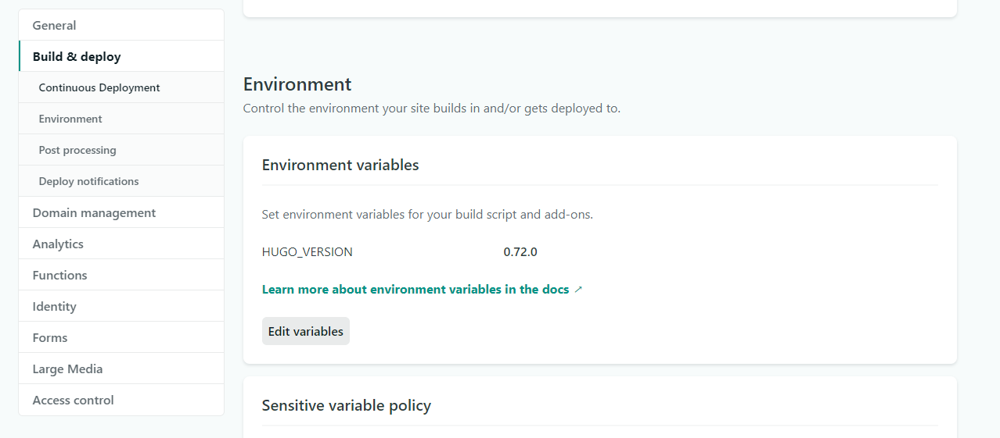
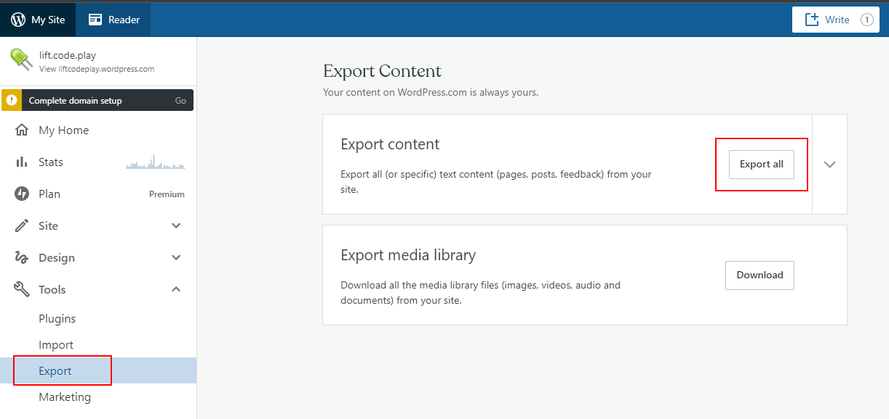

I moved from WordPress and survived! Here's how.

###### Photo by [Mantas Hesthaven](https://unsplash.com/@mantashesthaven?utm_source=unsplash&utm_medium=referral&utm_content=creditCopyText) on [Unsplash](https://unsplash.com/s/photos/goodbye?utm_source=unsplash&utm_medium=referral&utm_content=creditCopyText)

# Background

Back in 2015 I decided to start my own blog. At the time I wanted something easy to use and free of ads, so I went with WordPress.com (via a company called Automatic), purchased a domain, picked a theme and started writing.

The service has been great - works well, constantly improves, feature rich. But it always bugged me I was paying about $130 USD a year (especially as the exchange rate got worse). I sucked it up last year but now I finally decided to take the plunge and get it done. 

# Goal

I had a few goals for my blog:
* Free (well, aside from the domain)
* I want to control my domain. It was tied up as part of WordPress
* Minimize impact. I want my URLs to continue to work as other sites link to my blog
* Static site, with all the goodness that provides
* No cookies. No Google Analytics
* Would like some basic stats. Decided I'd be happy with stats from Cloudflare

# Step 1 - move my domain

I bought my domain through WordPress.com. There was a mechanism to allow me to transfer my domain so I moved it to Cloudflare. That was relatively painless. 

Big benefit there is it's wholesale prices, it's handles all things DNS and gives me a bunch of extra functionality incase I need it. 

The problem with this is that, while I setup all the DNS entries, WordPress later demanded I change the name servers. I can't do that in Cloudflare without paying for a different tier so I created a rule, in Cloudflare so that anything coming from `liftcodeplay.com` went to `liftcodeplay.wordpress.com`. This worked well.

# Step 2 - What tool or framework?

There are heaps out there! I chose Hugo
* It's easy to use
* Fast
* **Provides heaps of themes**

The last point was especially important as I quite liked my current WordPress theme and... because I suck at CSS, UI and UX. 

I chose the [Hugo Swift Theme](https://themes.gohugo.io/hugo-swift-theme/). It was close to what I had... but not quite. My site was a bit simpler and had three posts per row.

The theme made use of SASS, which meant I had to install the Hugo Extended. I'm on Windows and it was easy to [download and install](https://gohugo.io/getting-started/installing/)

```
choco install hugo-extended -confirm
```

Going back to theme: I managed to tweak it get it closer to my current look and feel. It's not as fancy as what I had but it will work nicely.

# Step 3 - Hosting provider

So many options! I decided to go with Netlify as I had little experience with it and it would be free. 

Setting up the site was a piece of cake: I hooked up my repo, in Github, and got it all working pretty quickly. 

I was also able to setup the DNS to point to Netlify but I later removed it, to do as a final step. 

There was only one thing that caught me out. In the Environment part of the Build & deploy I had to specify the Hugo Version. Easy enough... but the thing that caught me out was I had to specify a very precise version i.e. I'm on v0.72 but in the UI I had to type **0.72.0**, with the .0 at the end.



# Step 4 - Migrating my content

Turns out I had 87 blog posts plus 3 pages. That's a fair bit of content!

At first I tried to copy and paste the content and the images. It was painful but gave me some practice with markdown. 

I later [discovered this blog post](https://kevq.uk/how-to-convert-wordpress-to-markdown/). 

## Export Part 1 - Exporting from WordPress

I went in WordPress **Admin > Tools > Export** and selected **Export All**

I saved this file as **export.xml**



## Export Part 2 - Cloned the repo

Cloned the repo and put the **export.xml** in the root of the directory. 

```
git clone https://github.com/lonekorean/wordpress-export-to-markdown
```

## Export Part 3 - Converting WordPress to Markdown... with a bit of manual work

The tool worked well. The posts were Markdown and the images downloaded... but it wasn't perfect. For example:
* I wanted each post to list the author. It didn't
* It could create sub folders by year and month... but not day
* My Gists were being displayed as a link
* The banner image for each post was in the wrong directory
* Tags didn't get exported

I went into the code and extended it. It fixed the first two and the remainder I solved by hand.

# Step 5 - Building my pages

I had some pages - About and Talks. I recreated those by hand and tidied it up a bit. I don't recall the tool offering to export my pages.

# Step 6 - Testing, tweaking the UI

My primary concern were my recent posts from this year

I noticed the conversion process didn't work well for my oldest posts, from 2015. I chose not to care. Content is all there it's just the formatting that was off.

I was also able to confirm that everything looked in terms of Netlify and deployments. 

# Step 7 - Comments

A downside of the migration is I lost all the comments from users. There could be some good discussion. I decided I was ok with this but I wanted a mechanism for people to write comments. 

There was a service called Staticman that came with the theme but I couldn't get it setup. 

I was recommended [utteranc.es](https://utteranc.es/) and went with that. It was easy to setup. 

# Step 8 - Go Live!

The DNS entries for the site were all good to go. Had been days earlier but there was a rule that forwarded traffic to WordPress. I disabled the rule and I was all done - it worked!

Reviewing my goals, I achieved everything. Quite happy with the outcome as the process of blogging is so much better. 

I wrote all this in Visual Studio Code with preview enabled plus `hugo server` running so I had a hot loading, local view of my blog. In a moment I'll deploy by pushing a commit to `master` and I'll be done.