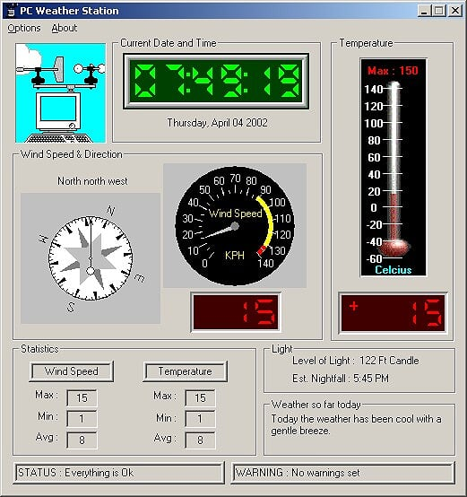

Over 20 years ago I brought a manual to a job interview. 

# Origins of this project

I was in my final year of studying electronics at college. In that last year everyone needed to build a project, which was assessed at the end of the year. 

## Hardware

I chose to build a PC Weather Station. It started with a kit that provided
* PC card with a parallel port
* Wind direction housing and card
* Wind speed housing and card

In addition I hand-build a temperature and light circuit board, which sent data to the same PC card. 

Amongst the more challenging pieces of work was the wiring. I had 37 wires running from a wiring box, under under the pole, and ultimately to a parallel connector.

## Software

The software has two core components:
1) The code which interfaced with the hardware, to get data
2) The user interface

C++ was used as it allowed low-level communication with the hardware and it happened to be the language we were learning at the time.

The tech stack was Visual C++, MFC and third-party Active X controls for the various dials and guages. The IDE was Visual Studio 6. 

## Manual and Presentation

As part of the project I had to write a manual and create a presentation for my class and teachers. 

Unfortunately I have lost the manual but I do remember being quite proud of it. 

I have a PDF copy of the presentation but it appears to have only saved the images and text. 

# The job hunt

I applied for a job at a local software company. I initially applied for an entry level job building installation programs, patches and services packs. 

