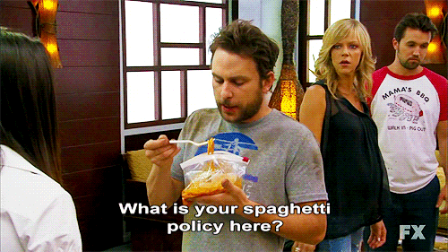
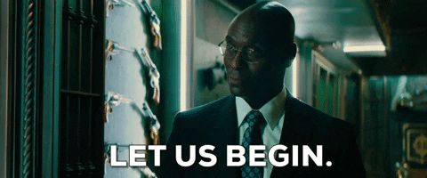
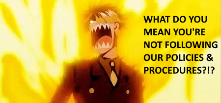

Two socks? No, SOC 2. A story of how this certification was achieved.

# Intro

The following is my personal experience going through the SOC 2 compliance journey. 

# Welcome to Wipster!

About 8 months ago I joined Wipster as their Chief Technology Officer (CTO). One of the first tasks I was given was this "SOC 2" thing. 

Turns out a major client is demanding it and, if we don't achieve it by their financial year end, we will lose them as a client.

# US: we take security seriously. THEM: prove it!

SOC 2 is about proving the org's committment to security. 

If you're going to sell to a medium to Enterprise-level clients they are going to ask you a lot of questions about security, policies and more. These questionaires can be very time consuming. SOC 2 certification short-circuits a lot of that. 

SOC 2 is similar to ISO27001. Word on the street is SOC is more common for US companies whereas ISO is more international. Also, apparently SOC is not as intense as ISO27001 - but still not to be taken lightly!

There are two types of SOC 2. 
* Type 1 is a "lite" version. Quicker, easier to do but most orgs don't respect it
* Type 2 is the standard version. When most people say "SOC 2" they often mean Type 2

I decided early on to aim for Type 2.

# Vanta

I remember thinking "how the heck am I going to achieve this?"

My predecessor had already done some ground work. There was a piece of software in place called [Vanta](https://www.vanta.com/). A call was setup with Becca, from Vanta. She gave me hope I could do this.

Over the coming months Becca guided me and answered many questions, big and small. I felt her guideance was, by far, the most important part of our SOC 2 journey.

## Why Vanta?

The [website explains it well](https://www.vanta.com/products/soc-2) but from my point of view:
* It connects into the various systems we have
* Ensures staff are compliant
* Will tell me if anything needs to be done

I could look at the main screen of Vanta and see if I was on the right track. For example: 
* the new hire may not have completed the security training
* I may be missing an important document
* perhaps there's some infrastructure in the cloud that requires further documentation.

If I didn't have Vanta it would be much harder and a far more manual process.

# Policies

First step was to implement all the policies Vanta was telling me I needed. 

Wipster had a bunch of policies written over the years. Some were fine, others needed work and we had gaps to cover. I spent time trying to reconcile them but ultimately, with Becca's help, decided it was best to just start again from scratch. 

Vanta provides a bunch of policy templates. They're very well written. My favourite was the Code of Conduct. It also has my favourite sub-section: our Weapons Policy (aka no weapons - sorry not sorry).

# The Great SaaS Cleanup

Another key component was having a precise list, in Vanta, of all the SaaS offerings we use. Things like PayPal, GitHub, Intercom and more. We had a surprising number of systems. Turns out some were not used for a while.

We generally don't use SSO with those services as we're small (and that's fine) but it meant that, if someone leaves, you need remove them manually. Turns out that didn't always happen.

That took a while but it was well worth it. We also managed to save some money.

# Much to do in Vanta

There was so much other work we had to, in order to be ready. I forget the detail (I choose not to remember?) but two things stick out. 

Vanta wants a description and owner for EVERY piece of infrastructure within Azure and every repo in GitHub. That took ages but was also a good exercise for me to understand precisely what we had and what it did. 

We also needed to supply a bunch documents / screenshots / URLs to prove we did things like vulnerability scans, performance reviews and kept company org charts.

It was all good but it took time and time was running out.

# Pen test

We needed a penetration test. It's a key requirement for SOC 2. You need one a year. 

When I looked at the rough timeline for everything and took the Christmas break into account, I realized I was short on time. I had to move fast with the pen tester. 

Vanta connected us with someone that could start ASAP. We got the report shortly before the Christmas break. In terms of findings, it was pretty good but they did find some issues. I had to divert some engineering resources (sorry product team!) and wait for everything to be addressed.

Once that was done the pen tester circled back and confirmed everything was fixed. That was the report I ultimately needed for SOC 2.

# Selecting the auditor

I was getting stressed. Even with the pen test done there was more to do - including choosing an auditor!

The team at Vanta put me in touch with an outfit in Australia. They seemed nice and got me to fill out a large questionaire, to assess my readiness. I struggled to answer the questions and the results didn't look good - as if there was so much more to do. They also made it sound like they didn't really care about what was in Vanta. 

I felt like an idiot and was close to despondency. I put so much time into Vanta and was told, repeatedly, that if Vanta was looking good then I should be good.

I decided to ask for an intro to a different auditor. Suffice to say they were a complete contrast, were very familiar with Vanta and filled me with confidence.

Sweet. Now I just had to hustle to finish some things before the auditor started.

# Observation period begins

With SOC 2 you have a minimum 3-month observation period (aka the audit) in which the auditor watches how you go. During that time you follow your policies and processes. If, for example, I took too long to offboard an employee the auditor would make a note of that. 

For the auditor, the observed us via Vanta. Everything they wanted was in there. I think they had something akin to a read-only view. 

Leading up to and during the observation period time it was key the team followed policies and procedures. The team were happy to comply but it took some gentle reminding i.e. if you're about to hire someone you need to do a police check.

# The quiet time and mountain bike crash

Overall, the observation period was very quiet. I was finally able to start diverting more energy elsewhere. 

About a month in I was out riding my mountain bike and crashed. I ended up in hospital. It would be 7 weeks before I returned to work. 

Thankfully it continued to be quiet while I was gone and the team continued to follow our processes. 

While I was away I asked the team to chip away at a "system description" which is essentially a big "about us" document. The final SOC 2 report is a combination of that completed document and their report. 

When I finally returned to work, doing 2 hours a day, my first task was to finish that document and submit it to the auditors.

# Certification achieved!

A few weeks later and I received the most excellent news early on a Monday morning: we have our final certification!

Best of all, we did it with 6 weeks to spare! That big customer gav us the maximum time possible and, had we not achieved it, we would have lost their business. 

# In closing

I went from knowing NOTHING about this to being able to achieve this on behalf of my org. It's a relief, knowing this is 100% done. 

In hindsight, I'm surprised I Was able to do it pretty much by myself, with the help of the vendors I mentioned. Talking to others that have done ISO, they talk of having a team of people and working on it for over a year. I had less than 8 months.

The process of getting ready for compliance was great for the organization. Overall, we were in pretty good shape but this was a forcing function to clean things up and ensure we had good policies and processes were in place.

The observation period will need to happen again next year, as will the pen test. Assuming we continue to follow our processes I reckon we'll be fine and it will be relatively straightforward. 